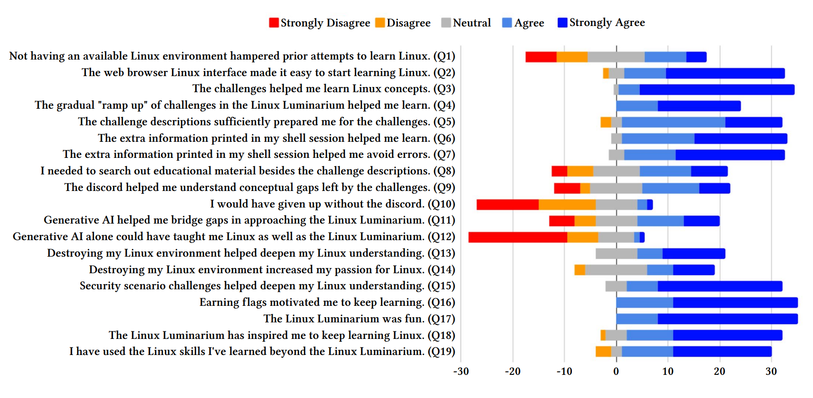
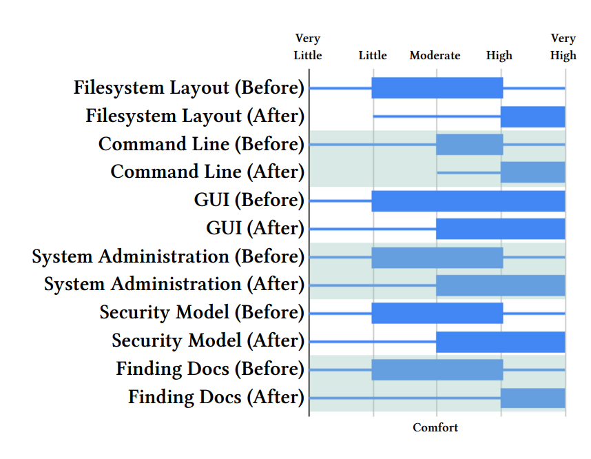

#  Learners Beyond our University

We also sent out a survey to learners who were not students at our
university and had engaged with the Linux Luminarium within the
last two months (so that their experience would be fresh in their
memory). Our IRB protocol limited us to respondents who resided
in the United States and were not students at our University. Over
60% of global Linux Luminarium users reside outside of the United
States, limiting our qualified respondents to 47.

In total, 47 learners responded to our survey. Of these, 1 was
a high school student[^1], 14 were undergraduate students, 8 were
graduate students, and 1 was in a vocational program, and 23 were
professionals.

Our survey included a number of Likert questions, which we
show (along with aggregated responses) in Figure 1. Additionally,
we asked them to (retroactively) rate their comfort level with certain
Linux concepts before and after their participation in the Linux
Luminarium. Finally, we asked free-response questions about their
biggest hurdles in learning Linux prior to the Linux Luminarium
and the biggest hurdle they faced in the Linux Luminarium. We
synthesize the results below.

**There is a value in structured learning resources.** In free-form
responses, the most common observation (11 responses) of the
biggest hurdle in attempts to learn Linux prior to the Linux Luminarium was the lack of structure in existing Linux Learning
resources. None of these learners reported the same hurdle for the
Linux Luminarium itself, reflecting the success of the structured
approach we take to Linux education.

**A turnkey, interactive Linux environment enables learning.**
About half of our learners reported being hampered in prior attempts at learning Linux by a lack of a readily-available Linux
environment, with the other half disagreeing (Q1). 7 learners mentioned this as their top hurdle in free-response questions. In freeform responses, the two most common reasons for having been
hampered by the lack of available interactive environments were
an uncertainty about how to set up a system for learning and a fear
of accidentally destroying it with an errant command once set up.

Despite half of the respondents disagreeing with Q1, Q2 shows
overwhelming agreement that the Linux Luminarium’s web interface helped learners start learning Linux.
<figure>

<figcaption>

**Figure 1: Likert survey questions and their responses by learners beyond our University. A total of 47 students completed the survey. All questions were optional.**

</figcaption>

</figure>

**The gamified, challenge-based curriculum is beneficial for both learning and motivation.** Learners reacted overwhelmingly
positively both to the use of hands-on challenges in learning (Q3)
and the use of Capture The Flag-style “flags” as additional motivation to solve these challenges (Q15). No respondents disagreed with
either statement, and agreed that the Linux Luminarium was enjoyable (Q16) and inspiring for further learning (Q17). While this motivational effect has long been observed in CTFs [[7](../references.md#ref7), [11](../references.md#ref11), [14](../references.md#ref14), [16](../references.md#ref16), [18](../references.md#ref18), [28](../references.md#ref28)],
we hope that reproducing this finding in even-earlier-stage education settings will be useful to future educators.

5 free-form responses listed the lack of available challenge problems as the top hurdle in their pre-Linux Luminarium attempts to
learn Linux.

**Guidance is good, but not perfect.** Learners overwhelmingly
reported that challenge descriptions equipped them to approach
the challenges (Q4), but most still needed to search out additional
(off-site) materials beyond these descriptions (Q7). Additionally,
in free-form responses, 7 learners reported vague, confusing, rambling, or incomplete problem descriptions as their biggest hurdle
in approaching the Linux Luminarium.

Beyond online documentation, modern learners also use additional interactive guidance via online communities (e.g., on learningdedicated Discord channels such as the one we created for Linux
Luminarium) or Generative AI (e.g., ChatGPT). We asked several
questions to measure the impact of these resources. Students reported similar positive impact (more of them agreeing than disagreeing) for both Discord (Q8) and AI (Q10), but disagreed with
both the assertion that the Discord help was critical (Q9) and that
Generative AI could replace the Linux Luminarium as a sole Linux
learning resource (Q11).

**Instrumented correction and guidance text helps learners learn.** The Linux Luminarium’s shell session instrumentation was
extremely helpful, with no respondents to Q5 (for learning) and Q6
(for avoiding errors) disagreeing and almost universal agreement.
As Linux Luminarium is the only platform that provides this feature,
this points to its usefulness as a first-stage Linux learning platform.

**Destruction can be constructive.** While both Destructive (Q12)
and Security (Q14) challenges improved understanding of Linux
concepts, the Security challenges appeared to be more useful. Typically, the Security challenges involve the combination of more
Linux concepts (e.g., data processing to brute force a password and
the Linux user/group model) than Destructive challenges (e.g., `rm -rf /`), so this makes sense, though we were pleased to see that the
latter remains useful as well.

**The Linux Luminarium increases learner comfort with Linux.**
We asked respondents to retroactively self-assess their comfort levels with different aspects of Linux as they were before starting and
after completing the Linux Luminarium, on a scale from 0 (Very
Little Comfort) to 4 (Very High Comfort). The results are presented
in Figure 2. Participants spanned the whole range of assessments,
with the median assessment in each category being Moderate familiarity (2). Participants reported median improvements between
0.7 (for the GUI, which learners only incidentally use to access the
material) to 1.3 (for the Security Model, which we explicitly cover
with the material).

Threat to Validity: since both estimations are retrospective (e.g.,
learners estimate their pre-Linux Luminarium knowledge after completing the Linux Luminarium), learners might subconsciously underestimate their Before knowledge or inflate the delta between Before and After because of a biased perception of self-improvement.
<figure>

<figcaption>

**Figure 2: Horizontal candlestick plot of self-assessed comfort levels with different areas/concepts of Linux among learners beyond our University on a scale from 0 (Very Little Comfort) to 4 (Very High Comfort). Both the Before (starting the Linux Luminarium) and After (completing the Linux Luminarium) self-assessments were performed retroactively. Participants reported median improvements between 0.7 (for the GUI, which students only incidentally use during their learning) to 1.3 (for the Security Model, which we explicitly cover).**

</figcaption>

</figure>

Ideally, we would survey the users before they access the Linux
Luminarium, but this is not something that our platform currently
supports. Regardless, we present this part of our data for completeness.

[^1]: Our study clarified that participants must be 18 years or older.
